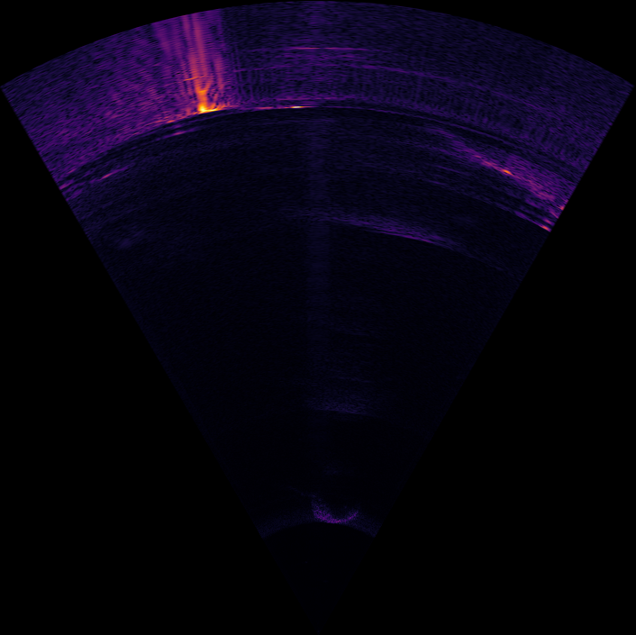
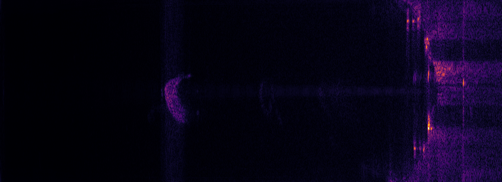

# sonar_image_proc

Code to draw data from forward-looking imaging sonars.

If built with `catkin` for ROS, it will enable support for [acoustic_msgs](https://github.com/apl-ocean-engineering/hydrographic_msgs/tree/main/acoustic_msgs) and build a ROS node/nodelet [draw_sonar](https://github.com/apl-ocean-engineering/libdraw_sonar/tree/master/src_ros) which subscribes to an [acoustic_msgs/SonarImage](https://github.com/apl-ocean-engineering/hydrographic_msgs/blob/main/acoustic_msgs/msg/SonarImage.msg) and publishes a [sensor_msgs/Image](https://docs.ros.org/en/melodic/api/sensor_msgs/html/msg/Image.html).

# ROS Interfaces
## Subscribers

Subscribes to the topic `sonar_image` of type [acoustic_msgs/SonarImage](https://github.com/apl-ocean-engineering/hydrographic_msgs/blob/main/acoustic_msgs/msg/SonarImage.msg).

## Publishers

By default publishes two topics.  `drawn_sonar` draws the sonar as a cartesian
image with the origin (range = 0) of the sonar centered on the bottom edge of the image,
and azimuth=0 extending vertically upwards in the image.  By default, the 
image height is set by the number range bins, and the image width is automatically
determined based on the height and the min/max azimuth of the sonar image.   The color
map used to convert the sonar intensity to RGB is set in code.

The topic `drawn_sonar_rect` is the contents of the SonarImage data drawn directly as an [sensor_msgs/Image](https://docs.ros.org/en/melodic/api/sensor_msgs/html/msg/Image.html).  Since the intensity data in the SonarImage is stored azimuth-major, the data is mapped into the image space with range in the X direction and azimuth in the Y direction:

 * Image width is the number of range bins in the data, with the minimum range on the left side and maximum range on the right side.
 * Image height is the number of azimuth bins in the data, with the lowest azimuth (typically the most negative) at the top, and most positive at the bottom.

If the param `publish_timing` is `true`, the node will track the elapsed time to draw each sonar image and publish that information to `sonar_image_proc_timing` as a [std_msgs/String](http://docs.ros.org/en/noetic/api/std_msgs/html/msg/String.html) containing a JSON dict.

If the param `publish_old` is `true`, the node will also draw the sonar using the old `draw_sonar` algorithm for comparison.

## Params

If `max_range` is set to a non-zero value, images will be clipped/dropped to that max range (or the actual sonar range, whichever is smaller).

If `publish_timing` is `true` the node will publish performance information as a JSON [string](http://docs.ros.org/en/noetic/api/std_msgs/html/msg/String.html) to the topic `sonar_image_proc_timing`.  Defaults to `true`

If `publish_old` is `true` the node will also draw the sonar using the old algorithm to the topic `old_drawn_sonar`.   Defaults to `false`

# API

Sonar drawing is implemented in the [SonarDrawer](include/sonar_image_proc/SonarDrawer.h) class, which takes an instance of an [AbstractSonarInterface](include/sonar_image_proc/AbstractSonarInterface.h) and returns a cv::Mat.   SonarDrawer computes and stores pre-calculated matrices to accelerate the drawing.

A convenience function [drawSonar](include/sonar_image_proc/DrawSonar.h) is also provided.  It is a trivial wrapper which creates an instance of SonarDrawer then calls it.  Calls to drawSonar do not retain the cached matrices and are less efficient.

# License

Licensed under [BSD 3-clause license](LICENSE).
